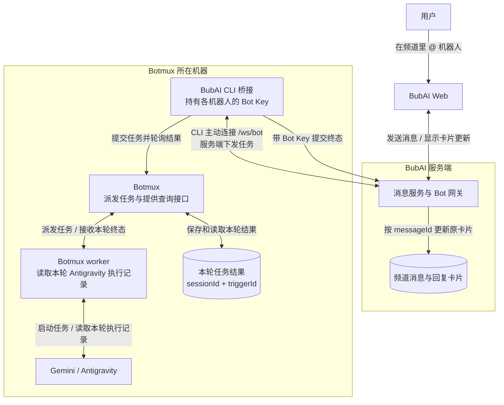
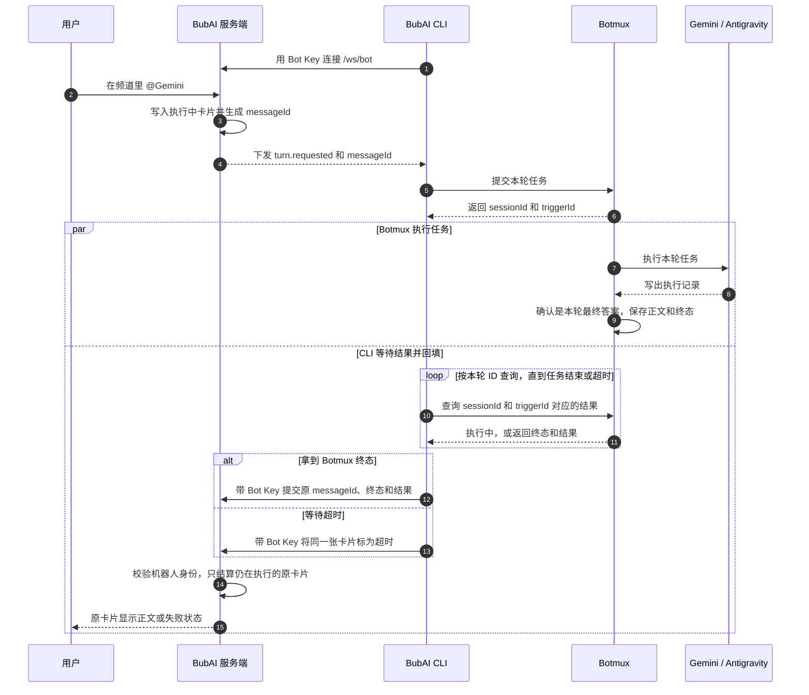

# BubAI 与 Botmux 桥接

用户在 BubAI 里发消息。Botmux 执行任务并保存结果，BubAI CLI 把结果填回原卡片。

## 架构图

```mermaid
flowchart TB
    User["用户"] -->|"在频道里 @ 机器人"| Web["BubAI Web"]

    subgraph Platform["BubAI 服务端"]
        Server["消息服务与 Bot 网关"]
        Cards[("频道消息与回复卡片")]
        Server -->|"按 messageId 更新原卡片"| Cards
    end

    subgraph Runtime["Botmux 所在机器"]
        direction LR
        Bridge["BubAI CLI 桥接<br/>持有各机器人的 Bot Key"]
        Daemon["Botmux<br/>派发任务与提供查询接口"]
        Worker["Botmux worker<br/>读取本轮 Antigravity 执行记录"]
        Agent["Gemini / Antigravity"]
        Results[("本轮任务结果<br/>sessionId + triggerId")]

        Bridge -->|"提交任务并轮询结果"| Daemon
        Daemon <-->|"派发任务 / 接收本轮终态"| Worker
        Worker <-->|"启动任务 / 读取本轮执行记录"| Agent
        Daemon <-->|"保存和读取本轮结果"| Results
    end

    Web <-->|"发送消息 / 显示卡片更新"| Server
    Bridge <-->|"CLI 主动连接 /ws/bot<br/>服务端下发任务"| Server
    Bridge -->|"带 Bot Key 提交终态"| Server
```

Gemini 将答案写入本轮执行记录，Bot Key 由桥接进程保管。

## 时序图

```mermaid
sequenceDiagram
    autonumber
    participant U as 用户
    participant S as BubAI 服务端
    participant C as BubAI CLI
    participant B as Botmux
    participant A as Gemini / Antigravity

    C->>S: 用 Bot Key 连接 /ws/bot
    U->>S: 在频道里 @Gemini
    S->>S: 写入执行中卡片并生成 messageId
    S-->>C: 下发 turn.requested 和 messageId
    C->>B: 提交本轮任务
    B-->>C: 返回 sessionId 和 triggerId

    par Botmux 执行任务
        B->>A: 执行本轮任务
        A-->>B: 写出执行记录
        B->>B: 确认是本轮最终答案，保存正文和终态
    and CLI 等待结果并回填
        loop 按本轮 ID 查询，直到任务结束或超时
            C->>B: 查询 sessionId 和 triggerId 对应的结果
            B-->>C: 执行中，或返回终态和结果
        end
        alt 拿到 Botmux 终态
            C->>S: 带 Bot Key 提交原 messageId、终态和结果
        else 等待超时
            C->>S: 带 Bot Key 将同一张卡片标为超时
        end
        S->>S: 校验机器人身份，只结算仍在执行的原卡片
        S-->>U: 原卡片显示正文或失败状态
    end
```
